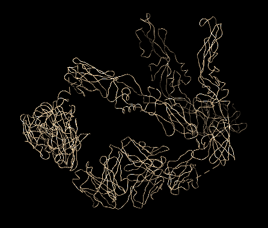

Special Residues
=================

This is a photo log of special residues found from the PDB101 selection of atoms.

For now this is a list of special PDB files that were discovered while testing the parser.

To document these unusual PDB files - screen captures will be used
when interesting from the [Chimera modeling system][1] and the 
unreleased `Molbrowser` project.

  [1] https://www.cgl.ucsf.edu/chimera/
  
2r6p
====
This interesting PDB was featured in the July 2008 PDB101 article on Dengue Virus.

* [PDB101 Dengue Virus July 2008][2]

  [2]: https://pdb101.rcsb.org/motm/103

The 2r6p PDB file contains only alpha carbon atoms in the ATOM list.   Normally the parser searches for guide atoms
to build the backbone ribbon information.   There are no other atoms in this file so this is impossible.
There are also no `HETATM`, `CONECT`, `HELIX` or `SHEET` records.  

The current `Molbrowser` provides just a space filling view 
and `Chimera` defaults to just the CA chain.

