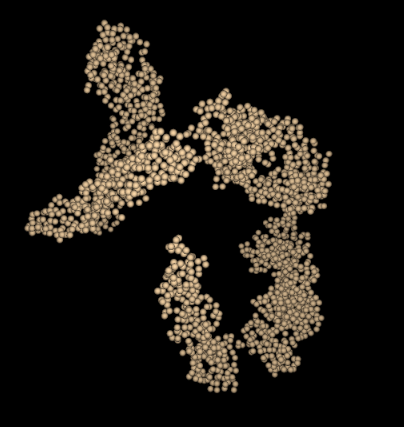

Special Residues
=================

This is a photo log of special residues found from the PDB101 selection of atoms.

For now this is a list of special PDB files that were discovered while testing the parser.

To document these unusual PDB files - screen captures will be used
when interesting from the [Chimera modeling system][1] and the 
unreleased `Molbrowser` project.

  [1]: https://www.cgl.ucsf.edu/chimera/

[2r6p][3]
----
This interesting PDB was featured in the July 2008 PDB101 article on Dengue Virus.

* [PDB101 Dengue Virus July 2008][2]

  [2]: https://pdb101.rcsb.org/motm/103
  [3]: https://www.rcsb.org/structure/2r6p

The 2r6p PDB file contains only alpha carbon atoms in the ATOM list.   Normally the parser searches for guide atoms
to build the backbone ribbon information.   There are no other atoms in this file so this is impossible.
There are also no `HETATM`, `CONECT`, `HELIX` or `SHEET` records.  

The current `Molbrowser` provides just a space filling view 
and `Chimera` defaults to just the CA chain.

[2zoi][5]
----
This PDB structure is unusual, in that it contains Deuterium atoms.
It was featured in the March 2017 PDB101 article on Photoactive Yellow Protein, specifically in
the section that discusses "Looking at the Hydrogens".

* [PDB101 Photoactive Yellow Protein March 2017][4]

  [4]: https://pdb101.rcsb.org/motm/207
  [5]: https://www.rcsb.org/structure/2zoi

The clever part of this PDB is the use of heavier Deuterium atoms instead of Hydrogen atoms - and then 
imaging.  As noted in the PDB101 entry:

    However, in most cases, X-ray crystallography doesn't allow us to observe 
    the hydrogens directly. Neutrons, on the other hand, are diffracted by the 
    nucleus of atoms, providing information on the location of hydrogen atoms. 
    The PYP neutron diffraction structure (PDB entry 2zoi) revealed a very 
    unusual arrangement, with a hydrogen atom shared between the chromophore 
    and a glutamate.  

Here is a `Chimera` based snapshot showing the "D" atoms in positions where normally
the hydrogen atoms occupy.

