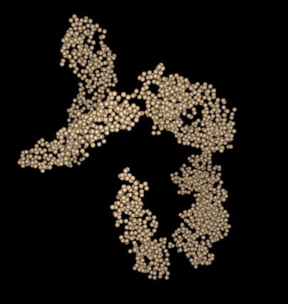
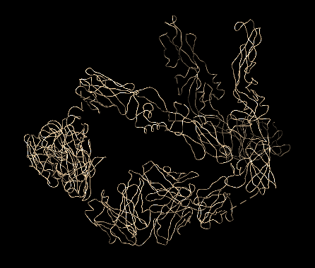
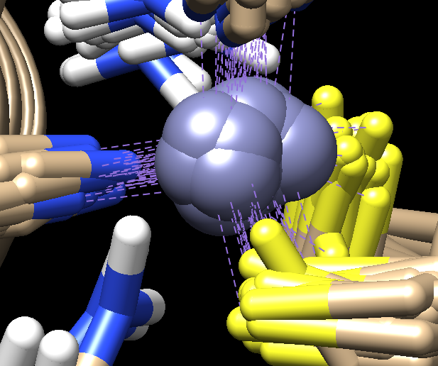

Special Structures
=================

This is a photo log of special residues found from the PDB101 selection of atoms.

For now this is a list of special PDB files that were discovered while testing the parser.

To document these unusual PDB files - screen captures will be used
when interesting from the [Chimera modeling system][1] and the 
unreleased `Molbrowser` project.  The parser test PDB files 
were the same as those featured in the 20 years of the [PDB-101 Molecule of the Month][1b] 
(_**MotM**_) feature of the [rcsb.org][1c].

  [1]: https://www.cgl.ucsf.edu/chimera/
  [1b]: https://pdb101.rcsb.org/motm/motm-about
  [1c]: https://www.rcsb.org/

[2r6p][3]
----
This interesting PDB was featured in the July 2008 **_MotM_** article on Dengue Virus.

* [MotM Dengue Virus July 2008][2]

  [2]: https://pdb101.rcsb.org/motm/103
  [3]: https://www.rcsb.org/structure/2r6p

The 2r6p PDB file contains only alpha carbon atoms in the ATOM list.   
Normally the parser searches for guide atoms
to build the backbone ribbon information.   
There are no other atoms in this file so this is impossible.
There are also no `HETATM`, `CONECT`, `HELIX` or `SHEET` records.  

The current `Molbrowser` provides just a space filling view 
and `Chimera` defaults to just the CA chain.

[2zoi][5]
----
This PDB structure is unusual, in that it contains Deuterium atoms.
It was featured in the March 2017 PDB101 article on Photoactive Yellow Protein, 
specifically in the section that discusses "Looking at the Hydrogens".

* [MotM Photoactive Yellow Protein March 2017][4]

  [4]: https://pdb101.rcsb.org/motm/207
  [5]: https://www.rcsb.org/structure/2zoi

The clever part of this PDB is the use of heavier Deuterium atoms instead of Hydrogen atoms - and then 
imaging.  As noted in the PDB101 entry:

    However, in most cases, X-ray crystallography doesn't allow us to observe 
    the hydrogens directly. Neutrons, on the other hand, are diffracted by the 
    nucleus of atoms, providing information on the location of hydrogen atoms. 
    The PYP neutron diffraction structure (PDB entry 2zoi) revealed a very 
    unusual arrangement, with a hydrogen atom shared between the chromophore 
    and a glutamate.  

Here is a `Chimera` based snapshot showing the "D" atoms in positions where normally
the hydrogen atoms occupy.

[1znf][7]
----
This is a fine example of a PDB file that contains numerous MODEL entries.
The PDB entry was discussed in the Molecule Of The Month on Zinc Fingers.

* [MotM Zinc Fingers March 2007][6]

  [6]: https://pdb101.rcsb.org/motm/87
  [7]: https://www.rcsb.org/structure/1ZNF

This particular PDB entry has 37 models.  It appears that the general structure
of PDB files containing models is that the ATOM list is repeated for each 
model with presumably the same series of residues.   At the end of the last 
model a common set of `CONECT` records appear.  That is the case 
for this [1ZNF][7] model where the `CONECT` records define the 
bonds to the Zinc atom in each model.   This can be seen in the
screen cap from the `Chimera` representation below.

The Kotmol PDB parser currently only captures the first `MODEL` in a PDB file.
If there is demand for more flexibilty to optionally capture
all models, then this could be added in the future.   This quote from the
[Leibniz-Forschungsinstitut für Molekulare Pharmakologie](https://www.leibniz-fmp.de/de/lange)
suggests that NMR techniques have a growing partnership with Cryo-EM 
techniques for studying difficult structures such as membrane proteins:

    Cryo-electron microscopy (cryo-EM) data define the overall envelope of the 
    assembly and rigid-body orientation of the subunits while solid-state NMR 
    chemical shifts and distance restraints define the local secondary structure, 
    protein fold and inter-subunit interactions.

